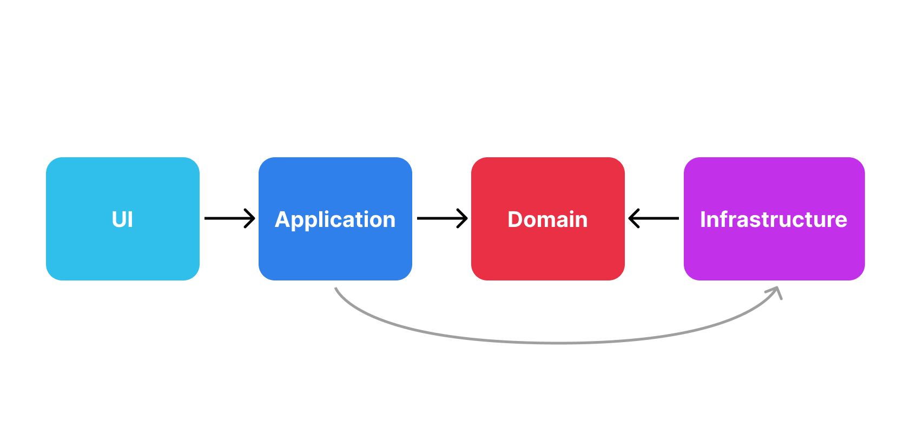

# React MVVM with Layered Architecture and DI

This repository implements a **React application** example with **MVVM (Model-View-ViewModel)** architecture, strict **layered boundaries**, and **Dependency Injection (DI)**.  
The goal is to maintain high modularity, enforce architectural boundaries, improve testability, and keep UI logic separate from business logic.

---

## Architecture Overview

### Layers

Layered Architecture organizes code into separate layers with strict dependency rules. The key idea is that **inner layers never depend on outer layers**.

| Layer                  | Responsibility                                                                       |
| ---------------------- | ------------------------------------------------------------------------------------ |
| **Domain**             | Pure business logic & domain models. Framework agnostic                              |
| **Infrastructure**     | External systems, APIs, persistence, environment configuration. Framework agnostic   |
| **Application**        | Use cases, application logic. Framework specific                                     |
| **UI**                 | React components, pure UI rendering, no logic. Framework specific                    |
| **Router & main file** | App bootstrap and routing. Framework specific. Might be different for each framework |

#### Layers Dependency Rules

In general, we can depict the layers and their dependencies as follows:



As we can see, our UI is completely decoupled from business logic and domain models. The only way for the UI to interact with the application is through **Application Use-Cases**.

#### More about layers responsibilities

- **Domain Layer**  
  As we mentioned, this layer contains pure business logic and domain models. But these models are not the exact replication of those models that you have on back-end or database. They are related only to business rules of the front-end application and can completely differ from back-end models.

For example, your back-end might have a `User` model with `id`, `name`, `email`, and `createdAt` fields, while your front-end domain model might not need all of these fields or might have additional fields related to UI state. There is also might be a case when front-end application has a model that exists only on front-end and has no back-end counterpart at all. For example, a `ShoppingCart` model that aggregates multiple `Product` models and manages cart state. So to keep in mind, that you need to thing about domain models from the perspective of front-end business rules only.

Also, this layer can have some processes related to models and how they interact with each other. For example, if you have a `Book` model and `Author` model, you might have a specific algorithm that defines how author rating is calculated based on the ratings of all books written by that author and his current popularity. This logic should also live in the domain layer.

- **Infrastructure Layer**
  This layer is responsible for interacting with external systems, APIs, and services. It provides implementations for repositories, API clients, and other services that the application layer depends on. The infrastructure layer should be designed to be easily replaceable, allowing for different implementations (e.g., mock services for testing).

The great examle is Http client. Despite the fact that we have a great `axios` package for making HTTP requests, we should not use it directly in our application layer. Instead, we should create an abstraction (e.g., `HttpClient` interface) in the infrastructure layer and incapsulate `axios` inside of it, so our application can rely on our own interface instead of the concrete `axios` detail (Dependency Inversion principle). This way, if we ever need to switch to a different HTTP client library, we can do so without affecting the rest of the application as long as interface stays the same.

Other things that can be placed in infrastructure layer are: local storage service, logging service, analytics service,auth service etc. But remember that this layer should not contain any business logic or framework related code in order to be easy transferable between different frameworks or platforms.

- **Application Layer**  
  This layer contains application-specific business logic and orchestrates domain models and infrastructure services. It defines **Use-Cases** that represent specific actions or operations that can be performed within the application. Any framework-related code can live here (such as React hooks, context, etc.), but it should not contain any UI rendering code.

- **UI Layer**
  This layer is responsible for rendering the user interface using React components. It should contain no business logic and should rely on the application layer to perform actions and retrieve data. The UI layer should be as simple as possible, focusing solely on presenting data and handling user interactions.

Additionally, UI layer has `components` that follow atomic design principles with next dependency order:

templates -> organisms -> molecules -> atoms

1. `atoms` - 1-st type of reusable UI components

- Depend only on props;
- Controlled (in most cases. Try to always make them controlled);
- Cannot depend on other reusable atom components from the same level;

2. `molecules` - 2-nd type of reusable UI components

- Can have internal state;
- Can be composed from `atoms` only;
- Cannot depend on other reusable molecule components from the same level;

3. `organisms` - 3-d type of reusable UI components

- Can be independent from incoming props and do specific scope of work;
- Can be composed from `atoms` and `molecules`;
- Cannot depend on other reusable organism components from the same level;

4. `templates` - 4-th type of reusable UI components

- Can be composed from `atoms`, `molecules` or `organisms`;
- Cannot depend on other reusable template components from the same level;

### MVVM

This application uses the **Model-View-ViewModel (MVVM)** pattern to provide better isolation between UI and business logic and also make UI code more testable and maintainable.

- **View**  
  React components responsible solely for rendering UI and exposing user interactions. They should not build a direct dependency on view-model but rather receive it via props using `DI.withVM` hoc.

- **ViewModel**  
  Hooks that encapsulate **presentation logic** and manage UI state.  
  The ViewModel:

  - Exposes observable state and derived UI state.
  - Accepts user input and serves as a bridge between View & Application Use-Cases.
  - Makes UI code easier to test by received its dependencies using `DI.inject`.

View-Model can be omited if the View needs no logic between View and Use-Case. In that case, the View can use `DI.withInjections` hoc to receive Use-Cases directly. Otherwise, each View (React component) should have its own View-Model.

View-Model is a good place to have forms state management and UI-specific validation that should be processed before calling Use-Cases.

- **Model**  
  There is no special Model layer in this MVVM implementation. Instead, the Model is represented by the **Domain Models**, **Domain Processes** and **Application Use-Cases**.

---

## Dependency Injection (DI)

In order to make UI more testable and maintainable, this application uses a simple **Dependency Injection (DI)** container which represented as a singleton object provided via React Context. This object should not contain any code that relies on React lifecycle and should have stable reference in order to not cause unnecessary re-renders.

**DI.withVM** - HOC that provides View-Model instance to the wrapped component via props. It accepts View-Model factory function as an argument and just passes the result of that factory to the View.

**DI.withInjections** - HOC that provides multiple dependencies from DI container to the wrapped component via props. You can use it to inject Use-Cases directly into the View if there is no need for View-Model intermediary.

**DI.inject** - hook that allows you to inject multiple dependencies from DI container into other hook. You can use it to create View-Model that depends on Use-Cases.

Basically, it's up to you whether to use Dependency Injection or not. It depends on the necessity to make your code more testable.

> [!NOTE]
> If you want to inject dependencies into Application Use-Cases you should do it without using DI container. Instead, you can use factory functions that accept dependencies as arguments and return Use-Case functions. This way, you can keep your Use-Cases pure and independent from the DI container.

Since DI container is a singleton object, you can add to that object any services or utilities that you want to share across the application. Just make sure that these services do not rely on React lifecycle in order to avoid issues with stale references. You can check the `src/application/di/di.registry.ts` file for an example of how to create DI container.

---

## Getting Started

### Prerequisites

- Node.js (LTS)
- pnpm

### Install

```sh
pnpm prepare && pnpm install
```

### Run in Development Mode

```sh
pnpm dev
```

### Build for Production

```sh
pnpm build
```

### Run static analysis

```sh
pnpm analyze-code
```

Check the `package.json` for more scripts.
